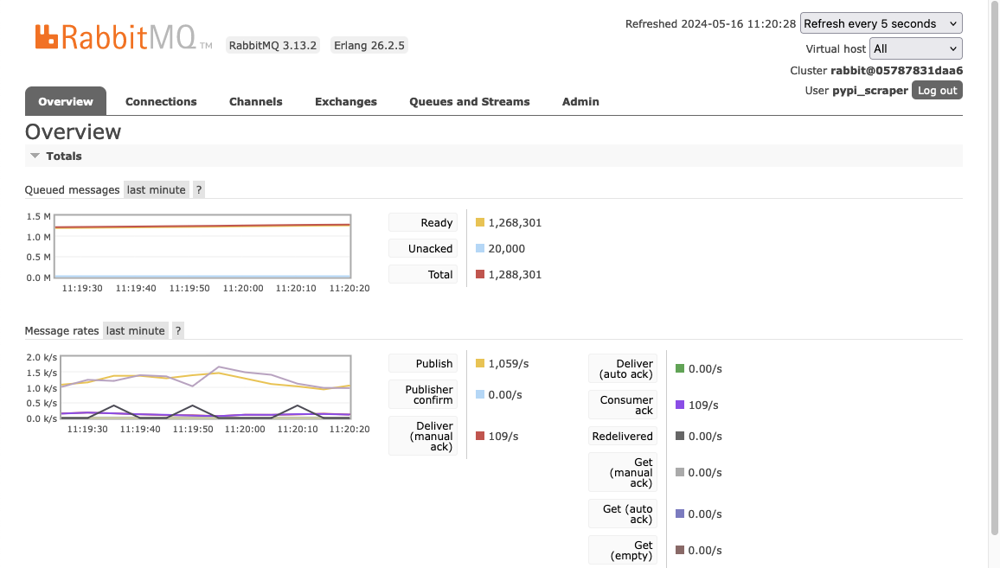
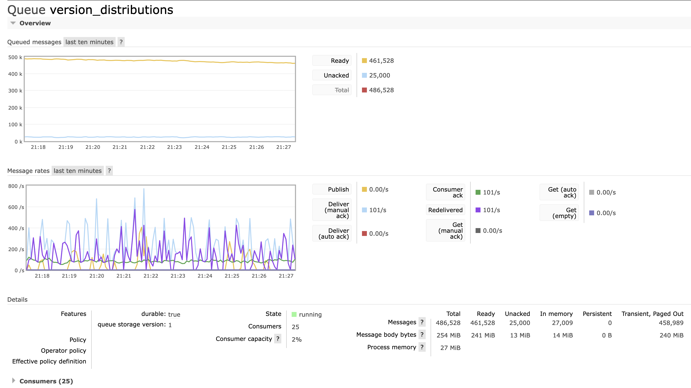
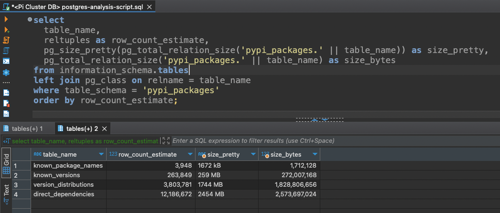
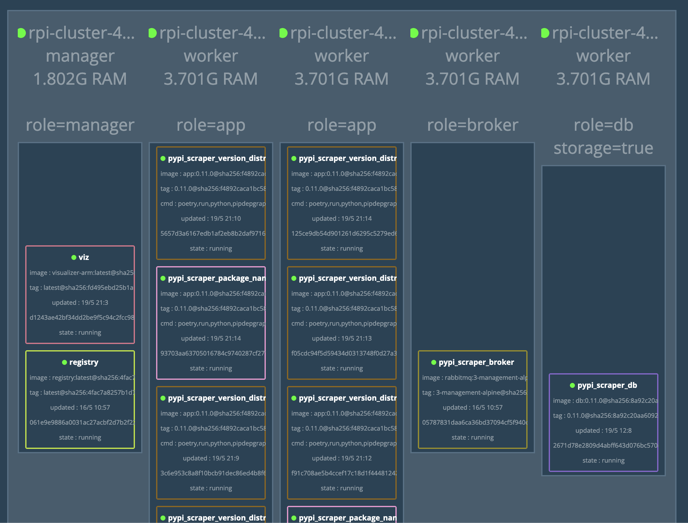
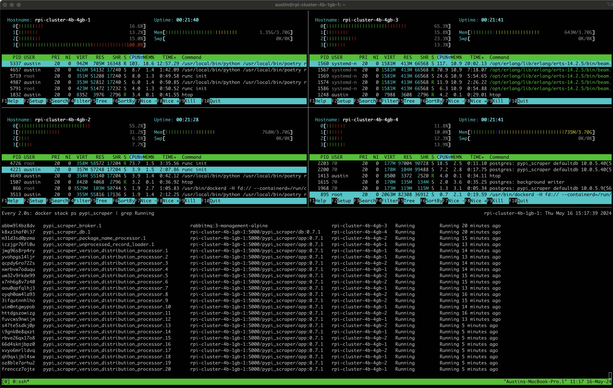

# Python Package Dependency Graph

Project goal: catalogue the dependency chain for all versions of all* packages.

\* This requirement will likely be revised.

My hypothesis is that you can dramatically speed up package version resolution, especially in a few hand-crafted failure cases. Such failure cases include fairly innocuous-looking pip install commands:

- `pip install 'z3-solver<4.11' crosshair-tool`
- `pip install boto3 "botocore==1.23.54"`
- `pip install boto3 'urllib3<1'`

The reason why I believe these can be improved is because there's no reverse-dependency information available anywhere online. Essentially, each version of `boto3` knows which versions of `botocore` it depends on, but neither `botocore` nor PyPI know which versions of `boto3` depend on specific versions of `botocore`.

## Screenshots

### RabbitMQ

Below is a screenshot from RabbitMQ showing 1.2M messages being processed, mostly version distribution records.



Below is a screenshot from RabbitMQ showing 500k messages being processed from the `version_distributions` queue. This screenshot was taken while the cluster was processing all of the PyPI packages which begin with the letter "A".



### Postgres

Below is a screenshot from Postgres showing a breakdown of each table's estimated row count and total size. In this screengrab, which was taken while the system was beginning to process all of the PyPI packages that start with the letter "A", the database is about 5.5GB in size.



### Docker Swarm Visualizer

Below is a screenshot from Docker Swarm Visualizer showing the roles of each node in my Pi cluster, plus some of the applications which are running on it.



### Tmux

Below is a screenshot of a terminal showing multiple tmux panes, most of them running htop on all of the worker nodes in the cluster, plus a pane listing the running service replicas.



## TODO

- Run through all of the unparsed versions in the database and see if any are actually parsable, but are simply too big and need to use the new `package_release_numeric` column.
- Currently not parsing platform compatibility from filenames.
  - Have a process for parsing that info from `.gz` and `.whl` filenames.
  - The file that those methods live in doesn't process `.egg` files.
- Need to do some analysis to see how much version information changes between different "version metadata"
- Tons of documentation
  - Method-level and class-level docstrings
  - Architecture diagram
- Unit tests

```py
# TODO: Persist this somehow.
# Supports "in" operator. `'3.5.2' in python_version_specs`
python_version_specs = (
    packaging.specifiers.SpecifierSet(distribution['requires_python'])
    if distribution['requires_python'] is not None else
    None
)

# TODO: Use this for persisting platform info.
_, _, _, version_tag_info = packaging.utils.parse_wheel_filename(distribution['filename'])
# Doesn't support .egg files. Need to figure that out.
```

## See Also

- Docs on Pip's solver
  - https://pip.pypa.io/en/stable/topics/dependency-resolution/
  - https://pip.pypa.io/en/stable/topics/more-dependency-resolution/
  - https://pypi.org/project/resolvelib/
- Libraries.io
  - Probably contains everything. Site is incredibly slow.
- Wheelodex
  - Has reverse dependency information. Doesn't have all versions of all packages.
  - https://www.wheelodex.org/
  - https://github.com/wheelodex/wheelodex
- Most downloaded packages
  - https://pypistats.org/
  - https://github.com/crflynn/pypistats.org
  - https://hugovk.github.io/top-pypi-packages/
  - https://wiki.python.org/moin/PackagePopularity
- https://pypi.org/stats/
  - Information about the size of PyPI's assets.
- https://pythonwheels.com/
  - "Wheels are the new standard of Python distribution and are intended to replace eggs."
  - https://www.python.org/dev/peps/pep-0427
- https://github.com/sethmlarson/pypi-data
  - Only has dependency information for the latest version of each package.
- https://dustingram.com/articles/2018/03/05/why-pypi-doesnt-know-dependencies/

## Docker Stack

Docker swarm/stack resources are based on my RPI cluster project.

https://github.com/AustinTSchaffer/Raspberry-Pi-Cluster-Ansible
