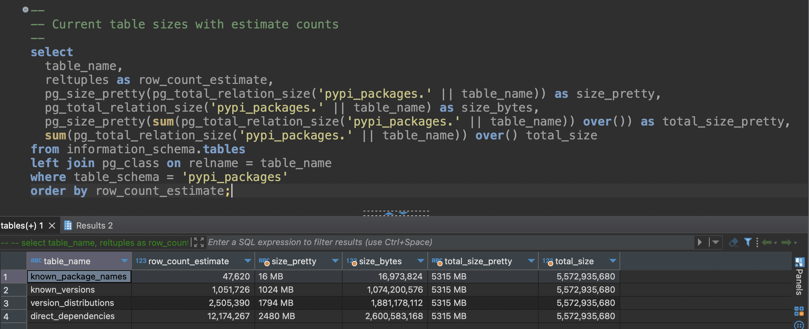

# Python Package Dependency Graph

Project goal: catalogue the dependency chain for all versions of all* packages.

\* This requirement will likely be revised.

My hypothesis is that you can dramatically speed up package version resolution, especially in a few hand-crafted failure cases. Such failure cases include fairly innocuous-looking pip install commands:

- `pip install 'z3-solver<4.11' crosshair-tool`
- `pip install boto3 "botocore==1.23.54"`
- `pip install boto3 'urllib3<1'`

The reason why I believe these can be improved is because there's no reverse-dependency information available anywhere online. Essentially, each version of `boto3` knows which versions of `botocore` it depends on, but neither `botocore` nor PyPI know which versions of `boto3` depend on specific versions of `botocore`.

## Screenshots

### RabbitMQ

Below is a screenshot from RabbitMQ showing 1.2M messages being processed, mostly version distribution records.


Below is a screenshot from RabbitMQ showing 500k messages being processed from the `version_distributions` queue. This screenshot was taken while the cluster was processing all of the PyPI packages which begin with the letter "A".


### Postgres

Below is a screenshot from Postgres showing a breakdown of each table's estimated row count and total size. In this screengrab, which was taken while the system was beginning to process all of the PyPI packages that start with the letter "A", the database is about 5.5GB in size.



### Docker Swarm Visualizer

Below is a screenshot from Docker Swarm Visualizer showing the roles of each node in my Pi cluster, plus some of the applications which are running on it.


### Tmux

Below is a screenshot of a terminal showing multiple tmux panes, most of them running htop on all of the worker nodes in the cluster, plus a pane listing the running service replicas.


## TODO

- Currently not parsing platform compatibility from filenames.
  - Have a process for parsing that info from `.gz` and `.whl` filenames.
  - The file that those methods live in doesn't process `.egg` files.
- Need to do some analysis to see how much version information changes between different "version metadata"
- Sometimes the unprocessed record loader becomes a zombie. Also pretty sure that at the DB's current size, running the loader causes all of the app nodes to crash.
- Tons of documentation
  - Method-level and class-level docstrings
  - Architecture diagram
- Unit tests

```py
# TODO: Persist this somehow.
# Supports "in" operator. `'3.5.2' in python_version_specs`
python_version_specs = (
    packaging.specifiers.SpecifierSet(distribution['requires_python'])
    if distribution['requires_python'] is not None else
    None
)

# TODO: Use this for persisting platform info.
_, _, _, version_tag_info = packaging.utils.parse_wheel_filename(distribution['filename'])
# Doesn't support .egg files. Need to figure that out.
```

## Estimate on Database Size

With the current schema, at this present moment. Here's the DB stats.

| table               | rows    | size_pretty | size_bytes |
|---------------------|---------|-------------|------------|
| known_package_names |    2936 | 368 kB      |     376832 |
| known_versions      |  477995 | 247 MB      |  258850816 |
| direct_dependencies | 2185832 | 455 MB      |  476807168 |

- Current num packages on PyPI: $530,000$
- Percentage of packages discovered:
  - $=2936/530000$
  - $=0.00554$
  - $\approx 0.55\%$
- Approximate full size of `known_package_names`
  - $=\frac{376832 \space\text{B}}{0.00554}$
  - $=68,020,216 \space\text{B}$
  - $=68 \space\text{MB}$
- Versions per package
  - $=477995/2936$
  - $\approx 163$
- Direct dependencies per package version:
  - $\approx 17.1$ deps per processed known version
  - (See analysis SQL script)
- Bytes per direct dependency
  - $=476807168/2185832$
  - $\approx 218 \text{B}$
- Num direct dependency records across all PyPI
  - $=530000*163*17.1$
  - $=1,477,269,000$
  - **1.48 billion `dd` records**
- Estimate full size of `direct_dependencies`
  - $=1,477,269,000*218 \space\text{B}$
  - $=322,044,642,000 \space\text{B}$
  - $=322 \space\text{GB}$
- Bytes per version record
  - $=258850816/477995$
  - $\approx 542 \space\text{B}$
- Num versions across PyPI
  - $=530000*163$
  - $=86,390,000$
  - **86.4 million `kv` records**
- Estimate full size of `known_versions`
  - $=86,390,000 * 542 \space\text{B}$
  - $=46,823,380,000 \space\text{B}$
  - $=46 \space\text{GB}$
- Total space required (2024)
  - $\ge 46 \space\text{GB} + 322 \space\text{GB}$
  - $\ge 400 \space\text{GB}$

Conclusion, totally doable.

## Package Cycles

It's possible for packages to have cycles in their dependency chains. This is
made evident by `ipython` depending on itself in a few cases.

```sql
select
    kv.package_name, kv.package_version, kv.python_version, kv.requires_python, kv.upload_time, kv.yanked,
    dd.extras, dd.dependency_name, dd.dependency_extras, dd.version_constraint
from known_versions kv join direct_dependencies dd
    on kv.known_version_id = dd.known_version_id
where dd.dependency_name = 'ipython' and kv.package_name = 'ipython';
```

|package_name|package_version|python_version|requires_python|upload_time            |yanked|extras               |dependency_name|dependency_extras                                                         |version_constraint|
|------------|---------------|--------------|---------------|-----------------------|------|---------------------|---------------|--------------------------------------------------------------------------|------------------|
|ipython     |8.24.0         |py3           |>=3.10         |2024-04-26 09:10:25.853|false |extra == "all"       |ipython        |kernel,nbconvert,black,notebook,parallel,doc,nbformat,qtconsole,matplotlib|                  |
|ipython     |8.24.0         |py3           |>=3.10         |2024-04-26 09:10:25.853|false |extra == "all"       |ipython        |test_extra,test                                                           |                  |
|ipython     |8.24.0         |py3           |>=3.10         |2024-04-26 09:10:25.853|false |extra == "doc"       |

## See Also

- Docs on Pip's solver
  - https://pip.pypa.io/en/stable/topics/dependency-resolution/
  - https://pip.pypa.io/en/stable/topics/more-dependency-resolution/
  - https://pypi.org/project/resolvelib/
- Libraries.io
  - Probably contains everything. Site is incredibly slow.
- Wheelodex
  - Has reverse dependency information. Doesn't have all versions of all packages.
  - https://www.wheelodex.org/
  - https://github.com/wheelodex/wheelodex
- Most downloaded packages
  - https://pypistats.org/
  - https://github.com/crflynn/pypistats.org
  - https://hugovk.github.io/top-pypi-packages/
  - https://wiki.python.org/moin/PackagePopularity
- https://pypi.org/stats/
  - Information about the size of PyPI's assets.
- https://pythonwheels.com/
  - "Wheels are the new standard of Python distribution and are intended to replace eggs."
  - https://www.python.org/dev/peps/pep-0427
- https://github.com/sethmlarson/pypi-data
  - Only has dependency information for the latest version of each package.
- https://dustingram.com/articles/2018/03/05/why-pypi-doesnt-know-dependencies/

## Docker Stack

Docker swarm/stack resources are based on my RPI cluster project.

https://github.com/AustinTSchaffer/Raspberry-Pi-Cluster-Ansible
